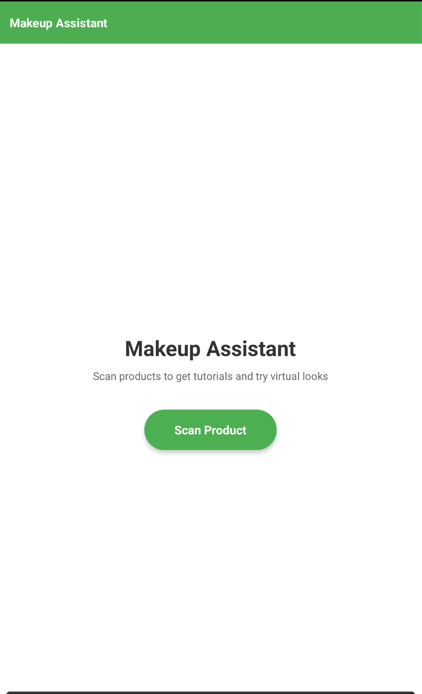
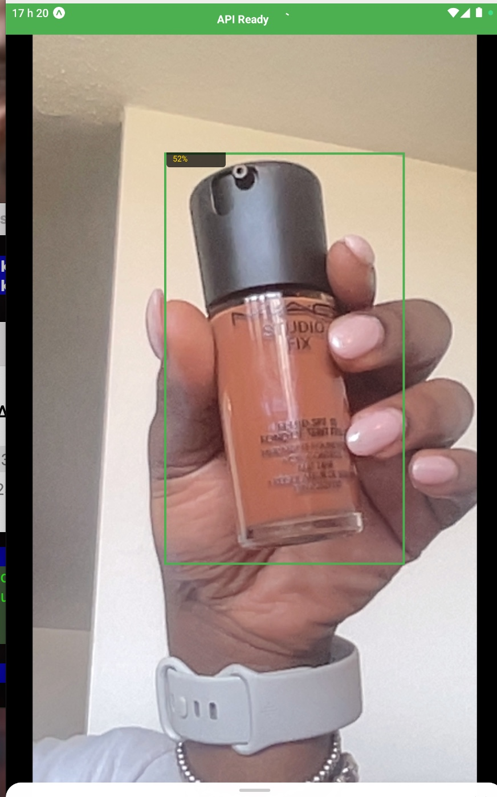
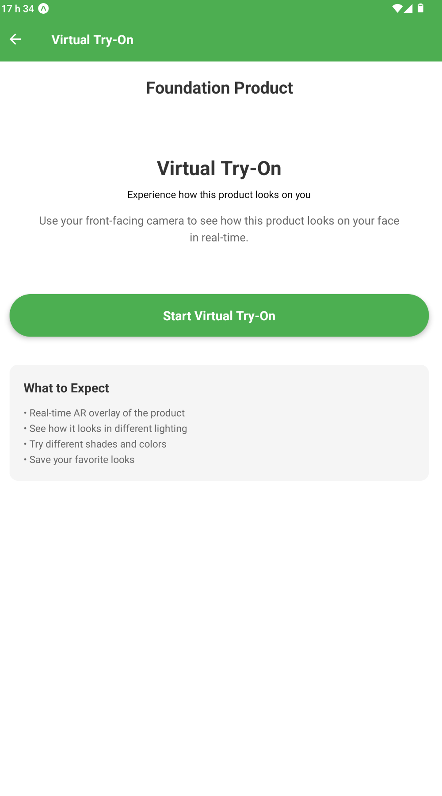
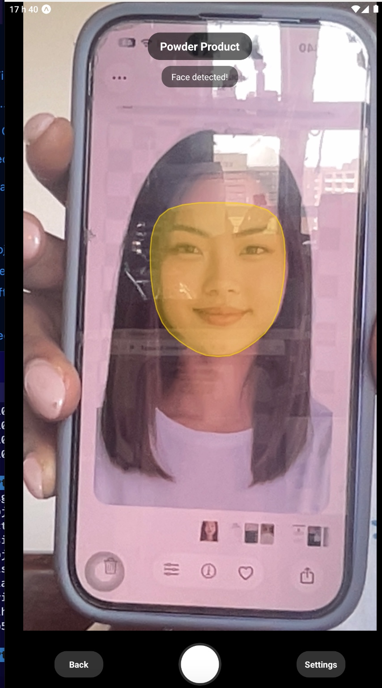

# SEA710 - Makeup Product Detection & Virtual Try-On Project

A computer vision application for detecting makeup products and providing virtual try-on experiences using object detection and face mesh technology.

## Project Overview

This project combines **YOLOv8 object detection** for makeup product recognition with **MediaPipe face mesh detection** to create an interactive mobile application that allows users to:
- Detect and classify makeup products in real-time using their device camera
- View product information and details
- Experience virtual try-on with face mesh overlays tailored to specific product types

The system consists of a **FastAPI backend** for model inference and face detection, and a **React Native mobile app** for the user interface.

## Demo

| Home Screen | Product Detection |
|:-----------:|:-----------------:|
|  |  |
| Launch screen with Scan Product button | Real-time YOLOv8 detection — MAC Studio Fix foundation detected at 52% confidence |

| Virtual Try-On Selection | AR Face Mesh Overlay |
|:------------------------:|:--------------------:|
|  |  |
| Product info screen before entering AR mode | MediaPipe face mesh overlay for powder/foundation products |

## Problem Description and Objectives

Finding and identifying makeup products automatically in images and video streams is challenging due to variations in lighting, packaging, colour, and brand designs. Many beauty platforms and AR applications require precise product recognition before recommending or applying virtual looks.

### Main Goals

Develop a complete system that can:
- **Detect and classify** makeup products from camera input (19 product types: beauty blender, blush, bronzer, brush, concealer, eye liner, eye shadow, eyelash curler, foundation, gel, highlighter, lip balm, lip gloss, lip liner, lip stick, mascara, nail polish, powder, primer, setting spray)
- **Run efficiently** on standard hardware without GPU dependency
- **Provide real-time detection** through a mobile interface
- **Enable virtual try-on** experiences using face mesh detection and product-specific overlays
- **Support facial region targeting** for product application (eyes, lips, skin)

## Final Deliverable

- **Trained YOLOv8 model** capable of identifying makeup product types from camera input
- **FastAPI backend** with product detection and face mesh endpoints
- **React Native mobile application** with:
  - Real-time product detection camera interface
  - Product information display
  - Virtual try-on with face mesh overlays
  - Product-specific mesh rendering
- **Labeled dataset** of makeup product images annotated for object detection
- **Complete documentation** and project report

## Project Structure

```
sea710-project/
├── mobile/                        # React Native/Expo mobile application
│   ├── App.js                    # Main app entry point
│   ├── app.json                  # Expo configuration
│   ├── package.json              # Node.js dependencies
│   │
│   ├── screens/                  # Application screens
│   │   ├── HomeScreen.js         # Entry screen with scan button
│   │   ├── ScanProductScreen.js  # Product detection camera screen
│   │   ├── VirtualTryOnScreen.js # Virtual try-on selection screen
│   │   └── FaceCameraScreen.js   # Face camera with mesh overlay
│   │
│   ├── components/               # Reusable UI components
│   │   └── ProductCard.js        # Product info card component
│   │
│   ├── navigation/               # Navigation configuration
│   │   └── AppNavigator.js       # React Navigation setup
│   │
│   ├── services/                 # API service layer
│   │   └── api.js               # Backend API communication
│   │
│   ├── config/                   # Configuration and feature flags
│   │   └── featureFlags.js      # Feature toggles and app config
│   │
│   └── utils/                    # Utility functions
│       ├── meshOverlays.js       # Face mesh overlay rendering
│       └── productClasses.js     # Product class enum and utilities
│
├── src/                          # Backend source code
│   ├── api/                      # FastAPI backend
│   │   ├── main.py              # API server entry point
│   │   ├── face_mesh.py         # MediaPipe face mesh detection
│   │   ├── product_classes.py   # Product class enum (Python)
│   │   └── README.md            # API documentation
│   │
│   ├── training/                 # Model training scripts
│   │   ├── train_yolo.py        # YOLOv8 training script
│   │   └── Training_expriement.ipynb  # Training experiments notebook
│   │
│   ├── utils/                    # Utility functions
│   │   ├── augment_yolo_train.py # Data augmentation utilities
│   │   ├── get_data.py          # Data retrieval utilities
│   │   └── preprocess_yolo.py   # YOLO preprocessing utilities
│   │
│   └── test/                     # Test images
│
├── models/                       # Trained model files
│   └── final/                    # Final trained models and results
│
├── dataset/                      # YOLOv8 formatted dataset
│   ├── train/                    # Training set (images and labels)
│   ├── valid/                    # Validation set (images and labels)
│   ├── test/                     # Test set (images and labels)
│   ├── preprocessed/             # Preprocessed dataset splits
│   ├── data.yaml                 # Dataset configuration
│   ├── README.dataset.txt        # Dataset documentation
│   └── README.roboflow.txt       # Roboflow dataset info
│
├── data/                         # Raw and processed images
│   ├── raw/                      # Original images by product category
│
├── docs/                         # Project documentation
│   ├── Augmentation_Documentation.md    # Data augmentation docs
│   └── Preprocessing_Documentation.md  # Preprocessing docs
│
├── requirements.txt              # Python dependencies
├── start_api.bat                 # Windows API startup script
├── start_api.sh                  # Mac/Linux API startup script
└── README.md                     # This file
```

## Quick Start: Running the Full Stack

This project consists of two main components:
1. **Backend API** (FastAPI) - Handles product detection
2. **Mobile App** (React Native/Expo) - Camera interface and UI

### Prerequisites

- **Python 3.8+** (for backend)
- **Node.js v14+** (for mobile app)
- **npm** or **yarn**
- **Expo CLI** (optional, included with Expo)

### Step 1: Setup Backend

1. **Install Python dependencies** (from project root):
   ```bash
   pip install -r requirements.txt
   ```

2. **Start the backend server**:
   
   **Windows:**
   ```bash
   start_api.bat
   # OR
   python -m src.api.main
   ```
   
   **Mac/Linux:**
   ```bash
   bash start_api.sh
   # OR
   python -m src.api.main
   ```

3. **Verify backend is running**:
   - Open browser: http://localhost:8001/health
   - You should see: `{"status": "healthy", ...}`
   - **Keep this terminal open** - server must stay running

4. **Load a model** (optional, but required for detection):
   - Visit http://localhost:8001/docs
   - Use `/load-model` endpoint to load your trained model
   - Or place model at `models/final/best.pt` (auto-loads on startup)

### Step 2: Setup Mobile App

1. **Find your computer's IP address**:
   - **Windows**: Run `ipconfig`, look for "IPv4 Address"
   - **Mac/Linux**: Run `ifconfig` or `ip addr`
   - **Or use helper**: `python find_ip.py`

2. **Configure API URL**:
   - Copy the environment template: `cd mobile && cp .env.template .env`
   - Edit `mobile/.env` and update with your IP address:
     ```bash
     API_BASE_URL_DEV=http://YOUR_IP:8000  # Replace with your IP
     API_BASE_URL_PROD=https://your-production-api.com
     ```
   - The `.env` file is gitignored and won't be committed

3. **Install mobile dependencies**:
   ```bash
   cd mobile
   npm install
   ```

4. **Start Expo**:
   ```bash
   npm start
   ```

5. **Run on device**:
   - Install **Expo Go** app on your phone
   - Scan the QR code from terminal/browser
   - Make sure phone and computer are on **same Wi-Fi network**

### Complete Workflow

```bash
# Terminal 1: Start Backend (macOS — uses ARM64 venv)
./venv/bin/python3.11 -m uvicorn src.api.main:app --host 0.0.0.0 --port 8001

# Terminal 2: Start Mobile App
cd mobile
npx expo start --clear
```

## Detailed Setup Instructions

### Backend Setup

#### Using Virtual Environment (Recommended)

**Windows:**
```bash
# Create virtual environment
python -m venv venv

# Activate
source venv/Scripts/activate

# Install dependencies
pip install -r requirements.txt

# Start server
python -m src.api.main
```

**macOS/Linux:**
```bash
# Create virtual environment
python3 -m venv venv

# Activate
source venv/bin/activate

# Install dependencies
pip install -r requirements.txt

# Start server
python -m src.api.main
```

#### Backend Endpoints

- **Health Check**: http://localhost:8001/health
- **API Docs**: http://localhost:8001/docs (Swagger UI)
- **Alternative Docs**: http://localhost:8001/redoc

### Mobile App Setup

See [mobile/README.md](mobile/README.md) for detailed mobile app setup instructions.


## Troubleshooting

### Backend Issues

- **ModuleNotFoundError**: Run `pip install -r requirements.txt`
- **Port 8000 in use**: Change port in `src/api/main.py` or stop other service
- **Model not loading**: Check model path, ensure file exists

### Mobile App Issues

- **"Connecting to server..."**: 
  - Backend not running? Start it first
  - Wrong IP address? Check and update in `ScanProductScreen.js`
  - Firewall blocking? Allow port 8000 in Windows Firewall
  - Different networks? Ensure phone and computer on same Wi-Fi

- **Build errors**: 
  ```bash
  cd mobile
  rm -rf node_modules
  npm install
  npx expo start --clear
  ```

### Network Issues

- **Can't connect from phone**: 
  1. Test from phone browser: `http://YOUR_IP:8000/health`
  2. If that works, it's an app configuration issue
  3. If that doesn't work, it's a network/firewall issue

- **Windows Firewall**: 
  - Allow port 8000 for inbound connections
  - Or temporarily disable firewall to test

## Mobile Application Overview

The mobile application is built with **React Native** and **Expo**, providing a cross-platform mobile interface for makeup product detection and virtual try-on.

### Key Features

1. **Product Detection**
   - Real-time camera feed with product detection
   - Visual bounding boxes and labels
   - Product information cards
   - Support for 19 product classes

2. **Virtual Try-On**
   - Face mesh detection using MediaPipe
   - Product-specific mesh overlays
   - Real-time AR rendering
   - Front-facing camera interface

3. **Feature Flags**
   - Mock detection mode for testing
   - Toggleable face mesh detection
   - Default vs class-based mesh rendering

### Mobile App Architecture

- **Screens**: Four main screens (Home, Scan Product, Virtual Try-On, Face Camera)
- **Components**: Reusable UI components (ProductCard)
- **Services**: API communication layer
- **Navigation**: React Navigation Stack Navigator
- **Config**: Feature flags and app configuration
- **Utils**: Mesh overlay system and product class utilities

See [mobile/README.md](mobile/README.md) for detailed mobile app documentation.

## Additional Resources

- **Backend API**: See [src/api/README.md](src/api/README.md)
- **Mobile App**: See [mobile/README.md](mobile/README.md)
- **AI Debugging Guide**: See [docs/AI_Debugging_Reference.md](docs/AI_Debugging_Reference.md) - Guide for using AI assistants to debug issues

## References

**Dataset Source:** first work. *makeup products detection Dataset* [Open Source Dataset]. Roboflow Universe. https://universe.roboflow.com/first-work-nnlbg/makeup-products-detection

**MediaPipe Face Mesh:** Google. *MediaPipe Face Mesh* [Computer Vision Library]. MediaPipe Solutions. https://developers.google.com/mediapipe/solutions/vision/face_landmarker

**React Native:** Meta. *React Native* [Mobile Framework]. React Native Documentation. https://reactnative.dev/

**Expo:** Expo. *Expo* [React Native Framework]. Expo Documentation. https://docs.expo.dev/

**React Native SVG:** react-native-svg Contributors. *react-native-svg* [SVG Rendering Library]. GitHub. https://github.com/react-native-svg/react-native-svg

## AI Disclosure

This project uses Generative AI tools such as Microsoft's Copilot to assist with:
- **Debugging**: Troubleshooting and understanding the context of error messages to help resolve code issues during development
   - Example prompt: "I get error (when starting app): (NOBRIDGE) ERROR  Warning: Error: Exception in HostFunction: Unable to convert string to floating point value: "large""
- **Research**: Investigating MediaPipe face mesh dimensions and coordinate transformations. Research recommendations for a tech stack when transitioning over to a mobile app versus desktop.
   - Example prompt: "would I be able to convert the UI to a mobile app instead? What is the tech stack going to look like?"

**Note**: Only approved GenAI applications were used, and no sensitive or confidential information was input into AI systems during development.

[Source: Seneca Library](https://library.senecapolytechnic.ca/c.php?g=736149&p=5401558)